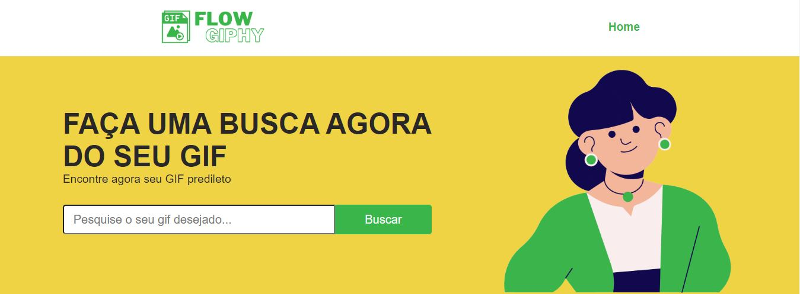
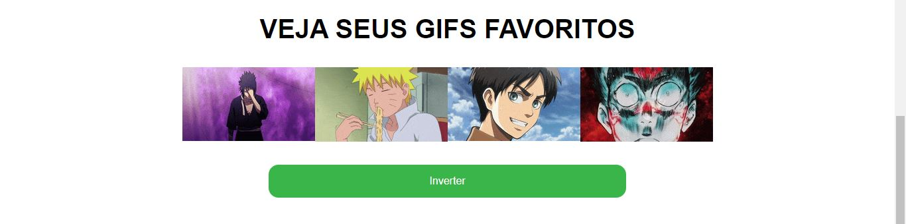
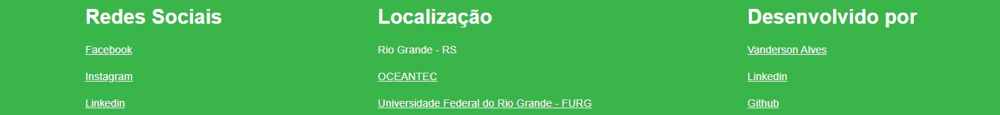

# Projeto FlowGiphy

## Descrição do projeto:
O projeto se trata de desenvolver uma página usando HTML, CSS e Javascript, para cadastro de gifs onde o usuário pode cadastrar e organizar a sua coleção.

## Status do projeto:
✅ Finalizado.

## Componentes importantes:
- [x] Design com HTML e CSS.
- [x] Busca através do Giphy API.
- [x] Função adicionar aos favoritos.
- [x] Função remover dos favoritos.

## Exemplo de funcionamento do projeto:

#### A primeira seção da aplicação possui um header e um banner com uma opção de busca de GIFS.

#### A segunda seção mostra o resultado de forma visual da busca dos GIFS.

#### A terceira seção é a dos FAVORITOS, onde mostra meus GIF favoritos selecionados juntamento com um botão para alterar ordem dos GIFS.

#### A quarta e última seção se trata de um footer simples com links importantes.

## Tecnologias utilizadas:
* HTML
* CSS
* Javascript

## Autor:
[Vanderson Alves](https://github.com/vanderson-alves) | [Linkedin](https://www.linkedin.com/in/vanderson-alves07/)
